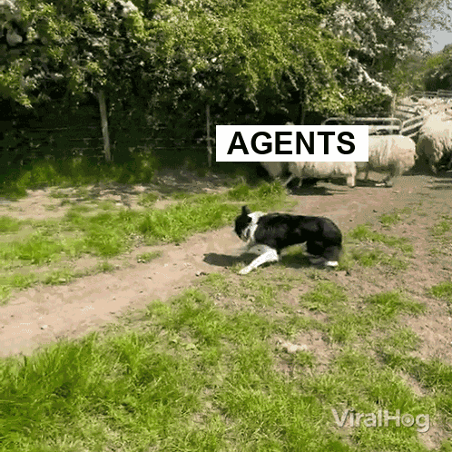

# Border Collie

A desktop border collie that watches your AI coding agent and reacts when something needs attention.



## What It Does

Border Collie is a small desktop companion for OpenCode.
In plain terms, it sits beside your coding agent, watches what the agent tries to do, and reacts when the agent is working, blocked, refused, failed, or claiming it is done.

The guard checks actions before they run, blocks work outside the task, and verifies important finish claims against the files in the project.

## Installation

Install the plugin from this repo:

```sh
node scripts/install-plugin.js
```

Or on macOS and Linux:

```sh
bash scripts/install-plugin.sh
```

On Windows, from Command Prompt:

```bat
scripts\win\install-plugin.bat
```

You also need Node.js, npm, Git, and OpenCode installed.

## Usage

Open any project with OpenCode:

```sh
opencode <path>
```

Run the companion by itself to see the demo:

```sh
cd pet
npm install
npm run start:demo
```

Work on the desktop companion UI:

```sh
cd pet
npm install
npm run start:dev
```

Animation asset storage and replacement notes live in [docs/ANIMATION_ASSETS.md](docs/ANIMATION_ASSETS.md).

Run the tests:

```sh
node test/run-tests.js
```

The live event inbox defaults to `~/.border-collie/events.jsonl`.
Set `BORDER_COLLIE_EVENTS` to use a different path.
