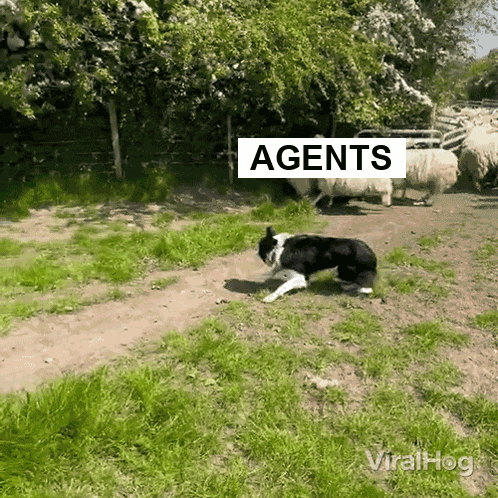

# Border Collie

A desktop border collie that watches your AI coding agent and reacts when something needs attention.



## What It Does

Border Collie is a small desktop companion for OpenCode.
In plain terms, it sits beside your coding agent, watches what the agent tries to do, and reacts when the agent is working, blocked, refused, failed, or claiming it is done.

The guard checks actions before they run, blocks work outside the task, and verifies important finish claims against the files in the project.

## Installation

OpenCode is the currently supported Guard-enforcing integration.
Codex CLI and Claude Code are not yet advertised as Guard-enforcing because their deny-before-run coverage has not been verified.

For the public npm package, install the CLI globally and then install the plugin:

```sh
npm install --global @quaannguyen/border-collie
border-collie install
```

The npm installation includes Guard and the desktop Pet.

To install from a source clone for development:

```sh
git clone https://github.com/QuaanNguyen/border-collie.git
cd border-collie
node scripts/install-plugin.js
```

Or on macOS and Linux:

```sh
bash scripts/install-plugin.sh
```

The installation includes Guard and the desktop Pet.
OpenCode v2 loads the package directory `~/.config/opencode/plugins/border-collie`. A configured path must point at that directory; a bare `border-collie.js` file is not a v2 plugin.
On macOS, the installer builds a small native host that uses the system WebKit framework and does not download Electron.
Windows and Linux use the locked Electron runtime.

On Windows, from Command Prompt:

```bat
scripts\win\install-plugin.bat
```

You need Node.js 22.12 or newer, Git, and OpenCode installed.
The macOS installation also needs Xcode Command Line Tools.
Windows and Linux installations need npm.

## Usage

Open any project with OpenCode:

```sh
opencode <path>
```

Inspect and select Border Collie profiles from the CLI:

```sh
bc profile list
bc profile create lab-research --from research
bc profile assign opencode lab-research
```

Set up the harness-neutral project Protocol without editing an OpenCode configuration path:

```sh
bc project setup --profile governed --write-path 'src/**'
```

Resize the Pet directly, without sending a UI preference through an agent conversation:

```sh
bc pet size 115
bc pet size reset
```

Work on the desktop companion UI:

```sh
cd pet
npm install
npm run start:dev
```

The development window includes animation controls plus local Event stream scenarios for working, allowed and refused actions, completion verdicts, review requests, errors, and Pet size.
It is a visual harness only: it does not start a network listener or alter the private Adapter-to-Pet event path used in production.
Use it to inspect the Pet's focus, visibility, geometry, dragging, and reactions without starting OpenCode.

Animation asset storage and replacement notes live in [docs/ANIMATION_ASSETS.md](docs/ANIMATION_ASSETS.md).
The Pet validates its complete animation contract before activating it, uses elapsed-time frame scheduling, and shows a stable frame when the operating system requests reduced motion.

Run the fast release-readiness checks:

```sh
npm test
npm run test:package
```

The current automated suite exercises unit behavior, non-UI integration behavior, the CLI, a no-download staged install, and the contents of the npm tarball.
See [the release guide](docs/RELEASING.md) for the release plan, test layers, and the work GitHub Actions can automate.
Pet UI, native window, renderer, and real OpenCode process coverage live in the e2e layer.

Run the focused Guard and plugin behavior tests:

```sh
node --test test/guard/*.test.js test/plugin/*.test.mjs
```

Guard events and active sessions exist only while OpenCode and the Pet are running.
The plugin sends Guard events over the Pet process's private input pipe.
Profiles and Pet size are persistent Border Collie owner preferences in the canonical Border Collie configuration.
